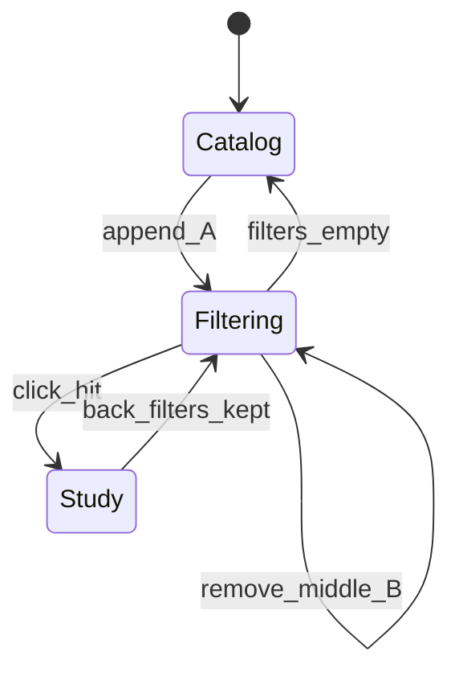
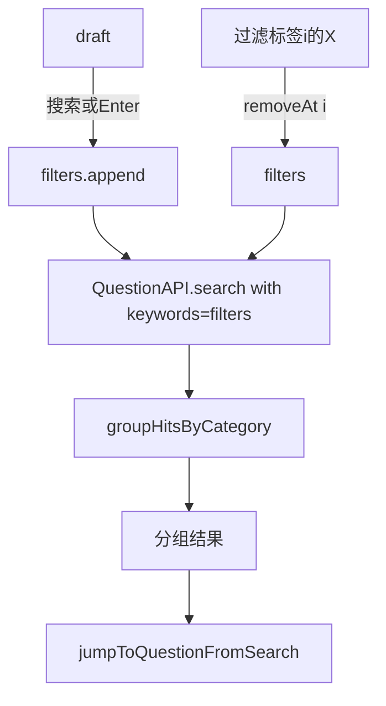

# 功能设计：题干搜索（v1.2 — AND 过滤链）

> 状态：**已实现（v1.2）**；取代 v1.1「全库查询栈 + 单过滤标签」  
> 约束：零后端 / 零构建 / 零运行时 npm；数据仅当前题库  
> 跳转契约保留：`jumpToQuestionFromSearch`（进入 `NavigationAPI.searchPlaylist`）  
> UI 跨页态：`src/render/session/`（UiSession，`browseSearch.filters`）  
> 路由：`#/browse`（旧 `#/catalog` 兼容）  
> 旧实现：v1.1 单过滤标签全库栈（已废弃）

---

## 0. 相对 v1.1 的变更动机

用户期望：

1. 第一次搜 **A**，第二次搜 **B** → 结果为 **A∩B**（在上一结果内收窄），不是全库只搜 B。  
2. 再搜 **C** → **A∩B∩C**。  
3. 界面为多枚可关过滤标签；**关掉中间的 B** → 剩余条件 **A、C**，结果为 **A∩C**。

这与 v1.1「每次全库重搜栈顶、× 只 pop」语义不同，故升到 **v1.2**。

---

## 1. 目标与非目标

**目标**

- 显式「搜索」/ Enter 提交（护 IME；输入不整页 refresh）  
- **有序 AND 过滤链** + **多过滤标签**（每级一枚，可关任意一级）  
- 结果按命中分类分组（同 v1.1）  
- **尊重导航范围**：若当前为「只练本类」（`category !== 'all'`），搜索 / 跳转建 playlist **只在该类内**；`statusFilter` 同理  
- 点进结果进 `searchPlaylist`；**不**为跳转清掉「只练本类」（退出搜索后仍回到该类）  
- 设计即测：状态机 SAR + API 链搜索 SAR + browse DOM  

**非目标**

- 拼音 / 分词 / 跨题库  
- keyword 写入 Navigation / localStorage  
- 默认搜选项（仍默认只搜题干；`fields` 可扩展）  
- 题干图片  
- 搜索结果分组上再挂「只练本类」按钮（已在该类范围内时无意义）

---

## 2. 复杂度评估

| 维度 | 是否增加 | 说明 |
|---|---|---|
| 整体 | **中等** | 比 v1.1 多：链语义、关中间级、多过滤标签；仍无后端/无 schema 迁移 |
| core 存储 | 否 | 不改 localStorage |
| API | **要小改** | 见 §4：链过滤应进 API，避免 UI 自造匹配 |
| UI | 要改 | 多过滤标签 + 状态从 stack 改为 filters[] |
| 测例 | 要加重写 | 状态机/DOM/API 链相关用例 |

**结论：** 会增加复杂度，但可控；关键是把「AND 求交」放进 API，UI 只管过滤词列表与展示。

---

## 3. 分层：谁做搜索？倾向哪一层？

| 层 | 职责 | v1.2 |
|---|---|---|
| **api `QuestionAPI`** | 在当前题库题目上做字段匹配、AND 链、limit | **主逻辑（倾向）** |
| **render/contracts** | `filters` 增删改纯函数；`groupHitsByCategory` | UI 状态机，无匹配规则 |
| **catalog.js** | 输入/过滤标签/分组渲染；调用 API | 薄 UI |
| **core** | 暂不强制抽；若匹配规则再复杂可抽 `matchQuestionText` | 可选 |

**倾向：API 做匹配与 AND，UI 做过滤词列表与展示。**

理由：

1. 匹配规则已在 `QuestionAPI.search`（大小写、fields、category/status），UI 再写一遍会分叉。  
2. 「关中间级 → 重算 A∩C」是数据查询语义，应单测锁在 api，不依赖 DOM。  
3. catalog 只持有 `filters: string[]`，每次变更调用一次链搜索即可。

**不建议：** 仅在 UI 里对上次 `hits` 数组再 `filter` 当唯一实现——关中间级时必须拿全库（或等价）重算 A∩C，UI 容易算错且难测。

---

## 4. API 设计（需更新 CONTRACT）

在现有 `search(keyword, options?)` 上扩展（推荐，少增方法）：

```typescript
QuestionAPI.search(
  keyword: string | string[],  // 或保持 string，另加 options.keywords
  options?: {
    fields?: Array<'question' | 'options' | 'explanation' | 'category'>;
    category?: string;
    status?: 'all' | 'none' | 'mastered' | 'review';
    limit?: number;
    /** v1.2：有序 AND 关键字；若提供则优先于单体 keyword */
    keywords?: string[];
  }
): Result<{ questions: Question[]; total: number }>
```

**行为（写死）**

1. 有效关键字列表 `terms` = `keywords`（若非空）否则 `[keyword]`；每项 trim，去掉空串。  
2. `terms.length === 0` → `{ questions: [], total: 0 }`。  
3. 在（可选 category/status 筛选后的）当前库题目上：**每一项 term 都必须命中**（AND；同一 `fields` 规则，大小写不敏感 `includes`）。  
4. 顺序不影响求交结果（A∩C === C∩A）；UI 仍保留顺序以便过滤标签展示与「关掉哪一级」。  
5. 仍只读、不 emit；`limit`/`total` 语义同现网。  
6. 单测：`['A','B']` 只返回同时含 A 与 B 题干的题；去掉 B 后调用 `['A','C']` 等。

实现时同步：`docs/CONTRACT-api.md`、`src/types.js`、`test/unit/question-search.test.js`。

---

## 5. UI 状态机

页面实例私有：

| 字段 | 含义 |
|---|---|
| `draft` | 输入框草稿（改 draft **不** refresh 列表） |
| `filters` | `string[]`，有序 AND 条件（左→右 = 早→晚） |
| `composing` | IME 组字中 |

派生：`isSearchMode = filters.length > 0`。

### 操作

| Action | 行为 |
|---|---|
| 搜索 / Enter（`!composing`） | `t = trim(draft)`；空 → toast；若 `t` 已在 filters **末尾**则仅 refresh；否则 **append** `t`；**成功后 `draft=''`（清空输入框）**，refresh |
| 点第 i 枚过滤标签的 × | `filters.splice(i, 1)`；若空 → 目录；否则用剩余 `filters` 调 API AND，refresh |
| （不做）点过滤标签文字 | 不跳转、不编辑 |

### 示例

```text
搜 A → filters=[A]           结果：含 A
搜 B → filters=[A,B]         结果：A∩B
搜 C → filters=[A,B,C]       结果：A∩B∩C
关 B → filters=[A,C]         结果：A∩C
关 A → filters=[C]           结果：含 C（全库语义下的单条件）
关 C → filters=[]            目录
```



---

## 6. UI 布局

```text
[← 返回刷题]  题库名 / N题
[ 搜索题干…              ] [搜索]
（有 filters 时）
  [ A × ] [ B × ] [ C × ]   共 N 题
练习设置 / 新增题目
── 按命中分类分组的结果（已在「只练本类」时通常仅一类）──
```

- 多枚 `lx-chip`；**仅 ×** 可点删除该级  
- 命中总数：过滤标签行右侧小字  
- 有分类范围时文案提示「搜索范围：仅「某类」」  
- 无单独「取消全部」按钮（关光过滤标签即回目录；可选后续再加）  
- 「清除分类」在搜索态下会使结果扩到全库并重搜  

### 与「只练本类」的关系（产品定稿）

| 当前导航 | 搜索行为 | 点进结果 |
|----------|----------|----------|
| `category=all` | 全库 AND 搜索 | playlist=全库命中；分类仍为 all |
| `category=甲`（只练本类） | **仅甲内** AND 搜索 | playlist=甲内命中；**分类保持甲** |
| 清除分类 | 立刻按全库重搜（若仍有 filters） | — |

---

## 7. 数据流



---

## 8. 代码落点（实现阶段）

| 文件 | 改动 |
|---|---|
| 本文档 | v1.2 设计（本版） |
| `src/api/question.js` + CONTRACT + types | AND `keywords` |
| `catalog-search-state.js` | `addFilter` / `removeFilterAt` / `groupHits…`（替换 push/pop 栈语义） |
| `catalog.js` | 多过滤标签；调用 `search({ keywords: filters })` |
| `question-search.test.js` | AND / 关中间级等价调用 |
| `catalog-search-state.test.js` | filters 增删 SAR |
| `catalog.buttons.test.js` | 多过滤标签、关中间级 DOM |

---

## 9. 测试设计（实现同 PR）

### 9.1 API

| S | A | R |
|---|---|---|
| 库中有只含A、只含B、含A且B | `keywords=['A','B']` | 仅双含 |
| 同上 | `keywords=['A','C']` | A∩C |
| 空 terms | search | total=0 |

### 9.2 状态纯函数

| S | A | R |
|---|---|---|
| `[]` | add `甲` | `[甲]` |
| `[甲,乙]` | removeAt(0) | `[乙]` |
| `[甲,乙,丙]` | removeAt(1) | `[甲,丙]` |
| `[甲]` | removeAt(0) | `[]` |

### 9.3 DOM

| S | A | R |
|---|---|---|
| 目录 | 只输入 | 无过滤标签 |
| 搜 A 再 B | — | 两枚过滤标签；结果为交集 |
| `[A][B][C]` | 关 B | 剩 A、C 过滤标签；列表为 A∩C |
| 关光 | — | 目录恢复 |

---

## 10. 实现顺序建议

1. API `keywords` AND + unit  
2. 重写 `catalog-search-state` + unit  
3. catalog 多过滤标签 UI  
4. 更新 catalog.buttons / FEATURE 状态改为「已实现」  
5. 真机中文输入 + test.html 全绿  

---

## 11. 与 v1.1 对照（废弃点）

| v1.1 | v1.2 |
|---|---|
| 全库重搜栈顶 | AND 收窄 / 重算交集 |
| 单过滤标签 | 多过滤标签 |
| × = pop 栈顶 | × = 删除该级条件并重算 |
| 「明确不做结果内 AND」 | **改为要做** |
